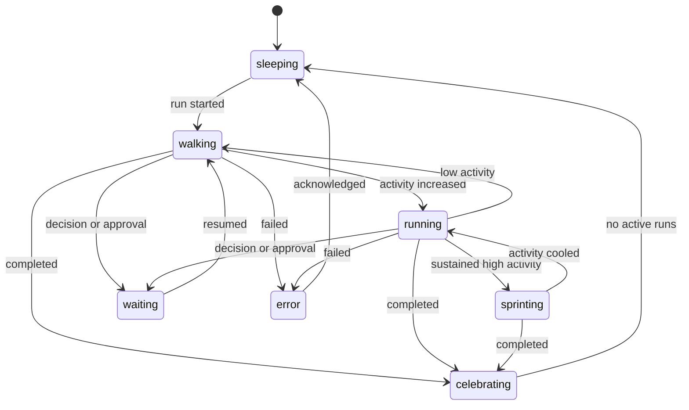

# Agent Dog Overlay Feature Plan

## 문서 목적

이 문서는 Harness agent가 작업할 때 화면 위에 강아지 캐릭터를 표시하고, 작업 활동량에 따라 sprite animation 속도를 바꾸며, 카드 진행 상황을 tooltip과 toast로 전달하는 선택형 desktop overlay 기능의 구현 계획이다.

첫 지원 대상은 macOS다. 공통 상태 계산, sprite renderer와 toast queue는 운영체제와 분리하고, window 제어만 platform adapter 뒤에 두어 이후 Windows를 지원할 수 있게 한다.

이 문서는 계획만 정의한다. 현재 작업 범위에는 실제 overlay, sprite asset과 platform code 구현이 포함되지 않는다.

## 선행 문서와 의존성

- [Harness Local Desktop Architecture](local-desktop-architecture.md)
- [`todo.md`의 local desktop 구조와 provider event 계약](../todo.md)

다음 선행 작업이 완료된 뒤 구현한다.

1. Electron main process와 typed IPC 기반 desktop shell
2. 구조화된 provider 실시간 event
3. task, run과 agent 상태의 project-local 영속화
4. desktop reload와 interrupted run recovery

overlay 기능을 위해 별도 HTTP server나 local monitoring daemon을 추가하지 않는다. desktop main process가 이미 보유한 run/event 상태를 IPC로 overlay renderer에 전달한다.

## 참고 자료와 라이선스 경계

행동 아이디어는 [Agent Cat Connectors](https://github.com/yong076/agentcat-connectors)의 local activity snapshot과 `sleeping`, `walking`, `running`, `sprinting` 단계에서 참고했다. 첨부 이미지에서는 화면 하단에 고정된 작은 캐릭터와 캐릭터 위에 쌓이는 작업 메시지 패턴을 UI 참고로 사용했다.

Agent Cat Connectors는 PolyForm Shield 1.0.0으로 공개됐으며 경쟁 제품을 위한 코드 사용을 제한한다. 따라서 다음 원칙을 지킨다.

- Agent Cat의 source code, installer, scoring code와 asset을 복사하거나 변형해 사용하지 않는다.
- reference repository의 threshold와 구현 세부를 그대로 이식하지 않는다.
- 캐릭터, sprite frame, 이름, 색상과 animation은 Harness용 독자 asset으로 제작한다.
- 첨부 이미지의 캐릭터를 tracing하거나 유사하게 재현하지 않는다.
- 상용 배포 전 asset provenance와 reference license 경계를 다시 검토한다.

## 제품 목표

- agent가 실제로 일하고 있는지 main board를 열지 않고도 가볍게 확인한다.
- 중요한 task 변화와 인간 결정 요청을 방해가 적은 toast로 전달한다.
- overlay는 업무·카드 상태를 한 방향으로 표시하며 캐릭터나 toast를 조작 UI로 사용하지 않는다.
- 다섯 종류의 강아지를 agent 또는 persona에 연결해 동시 실행 상태를 직관적으로 구분한다.
- 활동이 많을수록 캐릭터의 animation이 빨라지게 하되 실제 진척률을 근거 없이 추측하지 않는다.
- overlay를 완전히 끄거나 reduced motion으로 전환할 수 있게 한다.
- macOS에서 자연스럽게 동작하고 Windows 구현이 공통 로직을 다시 작성하지 않게 한다.

## 비목표

- 다른 application 화면을 캡처하거나 읽지 않는다.
- Accessibility 또는 Screen Recording 권한을 요구해 다른 application을 조작하지 않는다.
- provider prompt, transcript, source code와 diff 내용을 overlay에 표시하지 않는다.
- 캐릭터 클릭, 쓰다듬기, drag, context menu, toast button과 card open action을 제공하지 않는다.
- CPU 사용량만으로 task 진척률을 계산하지 않는다.
- agent가 끝날 시간을 임의로 예측하지 않는다.
- 첫 macOS release에서 Windows 전용 window behavior까지 완성하지 않는다.
- Agent Cat 또는 첨부 이미지의 asset과 source를 제품에 포함하지 않는다.

## 대표 사용자 흐름

### 작업 시작

1. 사용자가 Harness 카드에서 task 실행을 시작한다.
2. 해당 agent에 배정된 강아지가 overlay 영역에 나타난다.
3. `작업을 시작했어요` toast에 project, task title과 agent 이름을 표시한다.
4. 강아지는 초기 `walking` animation으로 전환한다.

### 작업 중

1. provider event가 들어오면 activity estimator가 agent별 activity score를 갱신한다.
2. 도구 사용과 event 빈도가 증가하면 `running` 또는 `sprinting` animation으로 전환한다.
3. 캐릭터를 hover하면 task title, 현재 phase, 경과 시간, 변경 파일 수와 마지막 안전한 status를 tooltip으로 표시한다.
4. 사소한 tool event는 toast로 띄우지 않고 tooltip의 현재 phase만 갱신한다.

### 인간 결정 대기

1. provider가 question, approval 또는 permission interaction을 생성한다.
2. 강아지는 `waiting` 또는 `asking` animation으로 전환한다.
3. 결정 toast는 질문이 있다는 사실과 card 상태만 읽기 전용으로 표시한다.
4. 사용자는 overlay가 아니라 Harness main window에서 interaction을 확인하고 응답한다.

### 완료와 실패

- 완료되면 짧은 `celebrating` animation과 완료 toast를 표시한다.
- 실패하면 `error` animation과 실패 상태 toast를 표시한다.
- transient animation이 끝나면 다른 active run이 없는 agent는 `sleeping`으로 전환한다.

## UI 구성

```text
┌──────────────────────────────────────┐
│  Toast 3: 인간 결정이 필요합니다      │
├──────────────────────────────────────┤
│  Toast 2: 테스트를 실행하고 있습니다  │
├──────────────────────────────────────┤
│  Toast 1: 작업을 시작했습니다          │
└──────────────────────────────────────┘
                   ┌───────────────┐
                   │ dog sprites   │
                   │ 🐕 🐕 🐕      │
                   └───────────────┘
```

- 기본 위치는 primary display work area의 오른쪽 아래다.
- 캐릭터는 고정된 overlay window 안에서 걷거나 뛰며 desktop 전체를 임의로 횡단하지 않는다.
- 사용자는 왼쪽 아래, 오른쪽 아래 또는 custom offset을 선택할 수 있다.
- 여러 agent가 실행되면 최대 5마리까지 작은 lane에 배치한다.
- 5개를 초과한 active run은 `+N` badge로 묶고 tooltip에서 전체 목록을 제공한다.
- main Harness window가 활성화된 경우에도 overlay 표시 여부를 설정할 수 있다.
- 캐릭터와 toast는 click, drag와 button을 처리하지 않으며 pointer 입력은 뒤 application으로 통과시킨다.

## 다섯 종류의 강아지

초기 breed 후보는 다음과 같다. 역할과 breed를 강제로 고정하지 않고 사용자가 agent별로 선택하거나 stable assignment를 사용할 수 있게 한다.

| Dog id | 초기 시각 후보 | 기본 성격 표현 |
| --- | --- | --- |
| `shiba` | 시바견 | 차분하고 집중하는 모습 |
| `retriever` | 골든 리트리버 | 밝고 협업적인 모습 |
| `collie` | 보더 콜리 | 빠르고 분석적인 모습 |
| `poodle` | 푸들 | 정돈되고 세밀한 모습 |
| `corgi` | 웰시 코기 | 활기차고 친근한 모습 |

### 배정 규칙

- project agent 설정에서 dog id를 명시할 수 있다.
- 지정하지 않으면 `agent.id`를 stable hash해 같은 agent가 같은 dog를 사용하게 한다.
- 동시에 같은 dog가 중복되면 outline, 목걸이 색상 또는 name badge로 구분한다.
- provider 종류를 dog breed와 직접 결합하지 않는다.
- 같은 agent가 여러 run을 병렬 실행하면 한 dog에 activity를 합산하고 active run 수 badge와 task 목록을 tooltip에 표시한다.

## Sprite asset 규격

### 파일 구조

```text
apps/desktop/assets/agent-dogs/
├── manifest.json
├── shiba/
│   ├── sprite@1x.webp
│   ├── sprite@2x.webp
│   └── sprite.json
├── retriever/
├── collie/
├── poodle/
└── corgi/
```

asset은 application bundle에 포함하고 project `.harness/`에 복사하지 않는다. project에는 agent와 dog id의 mapping만 저장한다.

### 공통 frame contract

- 모든 dog는 같은 state name과 frame layout을 사용한다.
- 기본 cell은 투명 배경의 `128 × 128` logical pixel로 한다.
- `@2x` asset을 제공하고 renderer가 device pixel ratio에 맞춰 선택한다.
- sprite metadata에 state, start frame, frame count, fps, loop와 anchor를 기록한다.
- 발 위치를 공통 baseline에 맞춰 state 전환 시 캐릭터가 튀지 않게 한다.
- WebP compatibility와 품질 문제가 있으면 PNG sprite sheet를 fallback으로 제공한다.

```json
{
  "version": 1,
  "frame": { "width": 128, "height": 128 },
  "animations": {
    "sleeping": { "start": 0, "frames": 4, "fps": 2, "loop": true },
    "walking": { "start": 4, "frames": 6, "fps": 8, "loop": true },
    "running": { "start": 10, "frames": 8, "fps": 12, "loop": true },
    "sprinting": { "start": 18, "frames": 8, "fps": 16, "loop": true },
    "waiting": { "start": 26, "frames": 4, "fps": 4, "loop": true },
    "celebrating": { "start": 30, "frames": 6, "fps": 10, "loop": false },
    "error": { "start": 36, "frames": 4, "fps": 6, "loop": false }
  }
}
```

frame 수와 fps는 art prototype 측정 후 조정한다. 다섯 dog 모두 동일 animation contract를 통과해야 release asset으로 등록할 수 있다.

## Animation 상태 모델



`waiting`은 작업량이 낮다는 의미가 아니라 인간 입력, rate limit 또는 외부 조건을 기다린다는 명시적 상태다. `celebrating`과 `error`는 일정 시간만 표시되는 transient override다.

## 작업 활동량과 animation 속도

### 입력 신호

우선순위가 높은 신호:

- active run 상태
- 최근 `text_delta`, `tool_use`, `tool_result`, `diff_hunk` event 빈도
- 현재 tool 실행 여부
- scheduler가 알고 있는 실행 중 subtask 수
- question, approval, permission과 rate limit 상태

보조 신호:

- provider child process CPU 사용량
- runnable process 여부
- 최근 변경 파일 event 빈도

CPU는 provider가 network 응답을 기다릴 때 낮아지고 local tool이 실행될 때만 높아질 수 있으므로 전체 score에서 보조 신호로만 사용한다.

### 독자 activity score 초안

각 agent에 대해 1초마다 다음 값을 `0..1`로 정규화한다.

```text
activity =
    activeRun      × 0.20
  + recentEvents   × 0.30
  + activeTool     × 0.25
  + runnableCPU    × 0.10
  + recentChanges  × 0.10
  + queuedWork     × 0.05
```

- 3초 EMA를 적용해 순간적인 event burst로 animation이 흔들리지 않게 한다.
- 단계 전환에는 서로 다른 진입·이탈 threshold와 최소 유지 시간을 둔다.
- `0.00`: active run이 없으면 `sleeping`
- `0.00..0.35`: `walking`
- `0.35..0.70`: `running`
- `0.70..1.00`: `sprinting`
- interaction 대기는 score와 관계없이 `waiting`으로 override한다.
- 완료와 실패는 각각 `celebrating`, `error`로 override한다.

threshold와 weight는 reference project 값을 복사하지 않고 Harness event replay fixture와 실제 사용 측정으로 조정한다.

### 속도 표현

- stage마다 기본 fps를 다르게 한다.
- 같은 stage 안에서는 score에 따라 fps를 최대 ±20% 조정한다.
- sprite가 overlay lane 안에서 이동한다면 pixel velocity도 score에 따라 조정한다.
- 화면 위치 이동보다 frame animation을 우선해 산만함과 motion sickness를 줄인다.
- `prefers-reduced-motion`에서는 정적 pose와 상태 badge만 표시한다.

## 진행 Tooltip

캐릭터 영역에 pointer가 머무르면 click 없이 읽기 전용 tooltip으로 다음 정보를 표시한다.

hover와 click은 캐릭터의 pose, animation state와 속도를 바꾸지 않는다.

- agent 이름과 dog 이름
- project와 task title
- `계획 중`, `파일 수정`, `검증`, `검토 대기`, `인간 결정 대기` 등의 현재 phase
- 경과 시간
- 변경 파일 수
- 완료된 subtask와 전체 subtask 수가 실제로 존재할 때만 progress fraction
- pending interaction 여부

실제 total work를 알 수 없으면 progress bar와 percentage를 표시하지 않는다. 대신 phase와 activity stage를 보여준다.

tooltip에는 source code, prompt, raw tool input, absolute file path와 secret을 표시하지 않는다.

## Toast 메시지

### toast를 만드는 event

- task 실행 시작
- 의미 있는 phase 전환
- 인간 질문, 승인 또는 권한 요청
- rate limit 또는 장시간 대기
- task 완료
- task 실패, timeout 또는 강제 중지
- merge approval 생성

개별 `tool_use`, text delta와 file write마다 toast를 생성하지 않는다.

### queue 정책

- 화면에는 최대 3개를 동시에 표시한다.
- 같은 run과 event type은 짧은 시간 안에 deduplicate한다.
- 일반 정보 toast는 5초 후 사라진다.
- 완료 toast는 8초 후 사라진다.
- question, approval와 permission toast는 일정 시간 표시한 뒤 작은 waiting badge로 축소하고 interaction이 해결될 때 제거한다.
- error toast는 일정 시간 뒤 작은 error badge로 축소하고 다음 run 또는 상태 변경 시 제거한다.
- 모든 toast는 읽기 전용이며 button, dismiss, retry와 card open action을 제공하지 않는다.
- toast는 card title과 안전한 상태 요약만 사용하고 model output 전문을 표시하지 않는다.

## macOS Overlay Window

### window 구성

- main board와 별도의 transparent, frameless Electron `BrowserWindow`를 사용한다.
- overlay window는 always-on-top과 dock/task switcher 비표시를 지원한다.
- 항상 click-through로 동작해 캐릭터와 toast를 클릭해도 뒤 application의 입력을 막지 않는다.
- forwarded mouse-move가 지원되는 경우에만 읽기 전용 hover tooltip을 표시하고 click 처리 mode로 전환하지 않는다.
- primary display가 아닌 display를 선택할 수 있다.
- display work area, Dock 위치와 menu bar를 고려해 bounds를 계산한다.
- display 연결·해제, 해상도 변경과 scale factor 변경 시 위치를 다시 계산한다.

### Spaces와 full-screen

- 여러 macOS Spaces에서 표시할지 사용자가 선택할 수 있게 한다.
- full-screen application 위에 표시, 자동 숨김 중 하나를 설정으로 제공한다.
- presentation 또는 screen sharing mode를 위한 빠른 숨김 action을 제공한다.
- overlay 자체 때문에 Screen Recording이나 Accessibility 권한을 요구하지 않는다.

### menu와 lifecycle

- menu bar 또는 Harness Settings에서 overlay를 켜고 끈다.
- global shortcut은 opt-in으로만 제공한다.
- main window를 닫아도 background run을 유지하는 정책과 overlay lifecycle을 일치시킨다.
- application 완전 종료 시 overlay renderer와 animation timer를 정리한다.

## Platform 추상화

```ts
interface OverlayPlatformAdapter {
  createWindow(options: OverlayWindowOptions): Promise<OverlayWindowHandle>;
  updateBounds(displayId: string, anchor: OverlayAnchor): Promise<void>;
  setInputPassthrough(): Promise<void>;
  setAlwaysOnTop(enabled: boolean): Promise<void>;
  setVisibleAcrossWorkspaces(enabled: boolean): Promise<void>;
  setFullscreenPolicy(policy: "show" | "hide"): Promise<void>;
  listDisplays(): Promise<OverlayDisplay[]>;
  onDisplaysChanged(listener: () => void): () => void;
}
```

공통 module:

- `OverlayStateEngine`
- `AgentActivityEstimator`
- `SpriteManifestLoader`
- `SpriteRenderer`
- `ToastQueue`
- `OverlaySettings`
- `OverlayEventSanitizer`

platform module:

- `MacOverlayPlatformAdapter`
- `WindowsOverlayPlatformAdapter`

macOS 구현 시 Windows adapter의 interface, contract test와 compile-time stub까지 만든다. renderer와 activity estimator는 platform 조건문을 포함하지 않는다.

## Windows 확장 고려사항

- transparent frameless always-on-top window behavior
- taskbar와 Alt-Tab 노출 여부
- per-monitor DPI와 scale factor
- 여러 monitor의 work area와 taskbar 위치
- 항상 유지되는 click-through와 forwarded hover 지원 여부
- virtual desktop과 full-screen application 감지
- high contrast, reduced motion와 text scaling
- installer asset, application id와 notification focus behavior

Windows 첫 구현은 Windows 11을 기준으로 수동 검증하고 Windows 10 지원 범위는 별도로 결정한다.

## 모듈 구조 제안

```text
apps/desktop/
├── assets/agent-dogs/
├── src/overlay/
│   ├── overlay-controller.ts
│   ├── overlay-ipc.ts
│   ├── overlay-preload.ts
│   ├── renderer-entry.ts
│   ├── overlay-settings.ts
│   ├── platform/
│   │   ├── types.ts
│   │   ├── mac.ts
│   │   └── windows.ts
└── src/main.ts

apps/web/src/overlay/
├── OverlayApp.tsx
├── DogSprite.tsx
├── AgentTooltip.tsx
├── ToastStack.tsx
├── sprite-runtime.ts
└── overlay.css

packages/runtime/src/activity/
├── activity-estimator.ts
├── activity-state.ts
└── activity-sanitizer.ts
```

실제 package 경계는 [Local Desktop Architecture](local-desktop-architecture.md)의 module 분리 진행 상황에 맞춰 조정한다.

## 설정과 저장 위치

사용자 전역 설정:

- overlay enable
- 위치와 display
- scale, opacity와 maximum dogs
- toast enable과 privacy mode
- reduced motion
- Spaces와 full-screen 정책
- sound enable은 기본 `false`

project `.harness/config.json` 설정:

- project별 overlay enable override
- agent id와 dog id mapping
- project별 toast 종류 선택
- card title을 overlay에 표시할지 여부

runtime activity score와 toast queue는 영속화하지 않는다. 중요한 원본 task/run/interaction event만 기존 Harness DB에 저장하고 overlay는 이를 파생해 표시한다.

## Privacy와 보안

- overlay event sanitizer는 allowlist 필드만 renderer로 보낸다.
- prompt, transcript, raw command, absolute path, diff와 tool result는 전달하지 않는다.
- 기본 toast에는 project 이름을 숨길 수 있는 privacy mode를 제공한다.
- screen sharing 빠른 숨김 기능을 제공한다.
- overlay renderer는 Node integration 없이 context isolation을 사용한다.
- sprite manifest와 asset path는 application bundle 내부 allowlist로 제한한다.
- overlay renderer에는 task mutation, URL open과 main window 제어 IPC를 노출하지 않는다.

## 접근성

- reduced motion에서는 정적 sprite와 상태 색상·text만 표시한다.
- animation 완전 정지 option을 제공한다.
- overlay는 focus를 받지 않으므로 동일한 상태를 main Harness UI의 접근 가능한 text로 제공한다.
- 상태를 색상만으로 표현하지 않고 icon과 text를 함께 사용한다.
- scale, opacity와 toast 유지 시간을 조정할 수 있게 한다.
- sound는 기본적으로 사용하지 않는다.

## 성능 목표

- overlay animation은 최대 30fps로 제한한다.
- `sleeping` 상태에서는 2fps 이하 또는 CSS timer 정지 후 간헐 frame만 사용한다.
- overlay가 숨겨지거나 display가 sleep 상태면 animation loop를 중단한다.
- 한 개 dog active 기준 Apple Silicon에서 overlay 추가 CPU 평균 2% 미만을 목표로 한다.
- overlay renderer memory는 asset 로딩 후 120MB 이하를 목표로 한다.
- sprite sheet는 필요한 dog와 resolution만 lazy load한다.
- provider event burst는 frame마다 직접 render하지 않고 coalesce한다.

## 구현 단계

### 0. 법적·디자인 준비

- 독자적인 5종 dog concept과 style guide를 확정한다.
- 각 asset의 제작자, license와 provenance를 기록한다.
- Agent Cat과 첨부 이미지 asset을 사용하지 않는다는 검수 항목을 만든다.

### 1. Activity state engine

- provider event fixture를 기반으로 activity score와 state machine을 구현한다.
- EMA, hysteresis, waiting override와 transient 완료·실패 상태를 test한다.
- progress를 알 수 없는 task에는 percentage를 만들지 않는 규칙을 적용한다.

### 2. Sprite runtime prototype

- 한 종류의 placeholder dog로 sprite manifest loader와 renderer를 검증한다.
- state 전환, fps 조절, reduced motion과 asset fallback을 구현한다.
- 실제 5종 asset 제작 전에 renderer contract를 고정한다.

### 3. macOS overlay window

- transparent always-on-top window와 항상 유지되는 click-through를 구현한다.
- display work area, Spaces, full-screen 정책과 display 변경을 처리한다.
- overlay enable, 위치, scale과 빠른 숨김 설정을 추가한다.

### 4. Tooltip과 toast

- sanitized agent status tooltip을 구현한다.
- 중요 event 기반 read-only toast queue, dedupe와 waiting/error badge 축소를 구현한다.
- overlay renderer에 main window focus, card deep-link와 mutation action을 노출하지 않는다.

### 5. 다섯 dog asset 적용

- 공통 frame contract로 다섯 sprite sheet를 제작한다.
- asset validator와 visual snapshot test를 추가한다.
- agent mapping과 동시에 여러 dog를 배치하는 lane을 구현한다.

### 6. 안정화와 macOS release

- performance와 memory budget을 측정한다.
- screen sharing privacy, reduced motion, multiple display와 sleep/wake를 검증한다.
- feature flag로 배포하고 crash가 main agent runtime에 영향을 주지 않게 격리한다.

### 7. Windows 지원

- `WindowsOverlayPlatformAdapter`를 구현한다.
- Windows 11 multi-monitor, DPI, virtual desktop, full-screen과 상시 click-through를 검증한다.
- 공통 renderer, sprite와 activity test를 그대로 재사용한다.

## 테스트 계획

### Unit

- activity score normalization
- EMA와 hysteresis
- explicit waiting, completion과 failure override
- toast dedupe와 priority
- privacy sanitizer allowlist
- agent-to-dog stable assignment
- sprite manifest validation

### Component

- 다섯 dog의 모든 state visual snapshot
- tooltip의 known/unknown progress 표시
- toast stack overflow와 passive waiting/error badge
- reduced motion과 scale 변경

### Desktop integration

- provider event → activity state → overlay IPC → sprite state
- main Harness에서 interaction 해결 → waiting toast와 badge 제거
- renderer reload 후 active state replay
- overlay crash 후 main runtime 유지와 overlay 재시작

### macOS manual matrix

- Intel과 Apple Silicon 중 지원 대상 architecture
- Retina와 non-Retina external display
- Dock 좌·우·하단
- multiple Spaces
- full-screen application
- sleep/wake와 display hot-plug
- screen sharing privacy mode

### Windows future matrix

- Windows 11, 100%·125%·150% DPI
- primary·secondary monitor 이동
- taskbar 위치와 auto-hide
- virtual desktop
- full-screen application
- high contrast와 reduced motion

## macOS MVP 완료 조건

- 5종 강아지를 agent에 배정할 수 있다.
- active agent가 있으면 overlay가 나타나고 run 상태에 맞는 animation을 표시한다.
- 작업 활동량이 지속적으로 변할 때 walking, running과 sprinting 속도가 안정적으로 전환된다.
- question, approval와 permission 요청은 sticky toast와 waiting animation으로 표시된다.
- tooltip은 실제로 확인 가능한 task 상태만 보여주고 임의 progress percentage를 만들지 않는다.
- 캐릭터와 toast를 클릭해도 반응하지 않고 입력이 뒤 application으로 통과한다.
- 완료·실패 toast는 card 상태를 읽기 전용으로 표시한다.
- overlay를 끄거나 reduced motion으로 바꿀 수 있다.
- 별도 HTTP server, Accessibility와 Screen Recording 권한 없이 동작한다.
- prompt, source code, absolute path와 credential이 overlay에 노출되지 않는다.
- overlay 오류가 provider run과 main board를 중단시키지 않는다.

## Windows-ready 완료 조건

- platform-neutral code가 Electron 또는 OS 이름을 직접 검사하지 않는다.
- macOS window 동작은 `OverlayPlatformAdapter`를 통해서만 호출한다.
- Windows adapter contract test와 compile-time stub이 macOS MVP에 포함된다.
- sprite, activity, tooltip과 toast renderer를 Windows에서 수정 없이 재사용할 수 있다.

## 구현 시 확인할 결정

- 최종 dog art style과 palette
- overlay 기본 위치와 크기
- 동시에 표시할 dog의 기본 최대 수
- main Harness window가 열려 있을 때 overlay 기본 표시 여부
- full-screen application에서 기본 hide 여부
- project와 task title을 기본 toast에 표시할지 여부
- completed animation과 toast 유지 시간

위 항목은 안전한 기본값으로 prototype을 만들 수 있지만 실제 asset 제작과 macOS 배포 전에 사용자 결정을 받는다.
