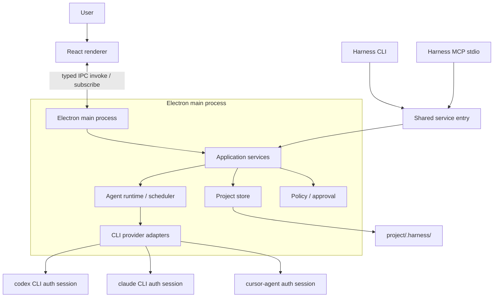

# Harness Local Desktop Architecture

## 문서 목적

이 문서는 Harness를 프로젝트별 `.harness/` 디렉터리를 중심으로 실행하고, 기본 사용 경로에서 별도의 HTTP server를 요구하지 않는 local-first desktop application으로 전환하기 위한 기준 설계다.

`todo.md`의 최우선 구조 작업과 이후 provider, interaction, MCP, review UI 작업은 구현 전에 이 문서를 먼저 읽고 경계를 따라야 한다. 구현 중 이 문서와 기존 코드가 충돌하면 application service 분리와 project-local 데이터 원칙을 우선하고, 필요한 설계 변경을 이 문서에 먼저 반영한다.

## 결정 요약

- Harness application은 사용자 기기에 한 번 설치한다.
- 각 project의 상태와 작업 산출물은 project root의 `.harness/` 안에 둔다.
- application binary와 UI bundle을 project마다 `.harness/`에 복사하지 않는다.
- desktop 기본 실행은 Electron main process와 React renderer 사이의 IPC를 사용한다.
- React renderer를 위해 별도의 persistent HTTP server를 실행하지 않는다.
- HTTP transport는 향후 headless 또는 remote 사용을 위한 선택 기능으로만 남기며 desktop 시작 시 자동 실행하지 않는다.
- CLI와 MCP는 HTTP route를 재사용하지 않고 동일한 application service를 호출한다.
- Codex, Claude, Cursor 등 CLI provider의 인증은 각 CLI가 보유한 기존 login session을 재사용한다.
- Harness UI에서 장기 API token 입력을 요구하거나 project `.harness/`에 provider credential을 저장하지 않는다.
- 직접 provider 연동이 반드시 필요한 경우에만 OAuth 2.1 Authorization Code with PKCE 또는 device authorization을 사용하고 credential은 OS 보안 저장소에 둔다.

## 목표

- project folder를 열면 `.harness/`를 발견하거나 초기화해 바로 board를 연다.
- project를 이동하거나 백업해도 project-local task, agent, run, document와 memory를 함께 보존한다.
- desktop, CLI와 MCP가 같은 validation, policy, approval, scheduler와 audit 규칙을 사용한다.
- provider process와 실시간 event stream을 desktop main process가 관리한다.
- application을 종료하고 다시 열어도 interrupted run, pending interaction과 event replay 상태를 복구한다.
- local desktop 사용자는 port, CORS, HTTP 인증과 background web server를 의식하지 않는다.

## 비목표

- Harness 실행 binary 전체를 project `.harness/`에 vendoring하지 않는다.
- provider의 OAuth access token이나 refresh token을 project 파일에 저장하지 않는다.
- renderer에 Node.js, filesystem 또는 child process 권한을 직접 노출하지 않는다.
- IPC 전환 과정에서 task, agent, run 등의 business rule을 renderer나 transport layer로 복제하지 않는다.
- 첫 구조 전환에서 remote multi-user server를 함께 구현하지 않는다.

## 대상 process 구조



React는 packaged asset을 `file://` 또는 application 전용 protocol에서 불러온다. renderer가 SQLite, Git과 provider process를 직접 다루지 않으며 preload가 노출한 좁은 typed API만 사용한다.

## 프로젝트 `.harness/` 구조

```text
project-root/
├── .git/
├── src/
└── .harness/
    ├── manifest.json
    ├── config.json
    ├── harness.db
    ├── harness.db-wal
    ├── harness.db-shm
    ├── agent/
    │   └── <agent-slug>--<short-id>/
    │       ├── agent.md
    │       └── instructions/
    │           └── <instruction-name>.md
    ├── artifacts/
    ├── attachments/
    ├── reports/
    │   └── <run-id>/completion-report.html
    ├── runs/
    │   └── <run-id>/
    │       ├── payloads/
    │       └── logs/
    ├── worktrees/
    ├── workspaces/
    ├── cache/
    └── runtime/
        ├── project.lock
        ├── instance.json
        └── harness.sock
```

Windows에서는 `harness.sock` 대신 project와 instance id를 포함하는 named pipe를 사용한다.

### 파일 소유권

| 경로 | 역할 | 보존 정책 |
| --- | --- | --- |
| `manifest.json` | project id, format version, DB schema compatibility | 영구 |
| `config.json` | 사람이 편집할 수 있는 project 설정 | 영구 |
| `harness.db` | task, run, interaction, approval, event index와 agent runtime/index 상태의 source of truth | 영구 |
| `agent/` | project agent의 역할, persona, 지침과 boundary Markdown 원본 | 영구 |
| `artifacts/` | agent가 만든 재사용 가능 산출물 | 영구 또는 사용자 삭제 |
| `attachments/` | 카드와 comment 첨부 파일 | 영구 또는 사용자 삭제 |
| `reports/` | 완료 보고서 HTML과 report asset | run 정책에 따라 보존 |
| `runs/*/payloads/` | DB에 넣기 어려운 큰 event payload | 보존 기간 설정 가능 |
| `runs/*/logs/` | provider process log | 보존 기간과 크기 제한 적용 |
| `worktrees/` | code task 격리 | merge, discard 정책에 따라 정리 |
| `workspaces/` | non-code task 작업공간 | task 정책에 따라 정리 |
| `cache/` | 재생성 가능한 데이터 | 언제든 삭제 가능 |
| `runtime/` | lock, socket, 현재 instance 정보 | application 종료 후 정리 |

`harness.db`와 별도 파일에 같은 structured record를 이중으로 저장하지 않는다. 큰 provider payload, attachment와 HTML report만 파일로 두고 DB에는 경로, hash, MIME type과 ownership을 저장한다.

agent 정의는 명시적인 예외로 `.harness/agent/<agent>/agent.md`를 기준 원본으로 삼는다. DB에는 agent id, 파일 경로, content hash, parse 상태, runtime status, current task와 실행 통계만 파생 index로 저장한다. role, persona와 instruction 본문을 DB와 Markdown 양쪽에서 각각 수정 가능한 원본으로 유지하지 않는다.

### Agent 정의 파일

각 agent는 생성 시 사람이 읽을 수 있고 id 충돌에 안전한 고정 folder를 갖는다.

```text
.harness/agent/reviewer--a1b2c3d4/
├── agent.md
└── instructions/
    ├── security-review.md
    └── output-format.md
```

`agent.md`는 versioned YAML frontmatter와 Markdown section을 사용한다.

```md
---
schemaVersion: 1
id: a1b2c3d4-0000-0000-0000-000000000000
name: Review Agent
role: reviewer
modelBackend: codex
capabilities: [review, testing]
allowedTools: [worktree, diff, tests]
maxParallel: 1
enabled: true
instructionFiles:
  - instructions/security-review.md
  - instructions/output-format.md
---

# Persona

변경 사항을 위험도와 검증 근거를 중심으로 검토한다.

# Instructions

- 변경된 코드와 테스트 결과를 함께 확인한다.
- 확인하지 않은 사실을 통과로 판단하지 않는다.

# Boundaries

- review task에서는 source code를 직접 수정하지 않는다.
```

folder name은 표시 이름 변경과 분리된 stable path로 취급한다. app과 web은 agent 생성 시 folder와 `agent.md`를 만들고, 변경 시 temporary file 작성 후 atomic rename으로 저장한다. 외부 editor 변경은 file watcher가 감지한다. parsing에 실패하면 실행 중 run은 시작 당시 snapshot으로 계속하고 해당 agent의 새 run은 차단하며 UI에 오류를 표시한다. archive는 `.harness/agent/.archive/` 아래로 folder를 이동해 Markdown 원본을 보존한다.

instruction file은 agent folder 밖을 참조할 수 없고 symlink, `..`와 absolute path를 허용하지 않는다. provider credential과 secret은 agent Markdown에 기록하지 않는다. 각 run은 실행 당시 agent definition hash와 사용한 Markdown snapshot을 기록해 이후 파일이 바뀌어도 실행 맥락을 재현할 수 있게 한다.

agent application service는 structured patch와 raw Markdown save, instruction 생성·수정·이름 변경·순서 변경·제거, clone과 archive를 하나의 atomic writer와 validation 경계로 처리한다. 모든 write는 `agent.md` content hash와 instruction hash를 비교해 stale overwrite를 거부한다. parsing에 실패한 파일도 raw source와 hash는 반환해 수정할 수 있으며 새 run만 차단한다. DB의 name, role, persona와 실행 설정 열은 runtime/planner 조회를 위한 파생 cache로만 사용하고 `agent.md` sync 외 경로에서 독립 편집하지 않는다.

archive는 active 또는 suspended run이 있으면 거부한다. 완료되지 않은 assigned task가 있으면 replacement agent 또는 명시적 unassign을 요구하고, 통과하면 folder 전체를 `.harness/agent/.archive/<agent-folder>/`로 atomic rename한 뒤 DB에는 archive path, runtime 상태와 history 연결만 남긴다. clone은 source의 custom section과 instruction Markdown을 새 stable id folder에 복사하며 기본적으로 disabled 상태로 시작한다.

agent 관리 UI는 구조화 form과 raw Markdown editor가 하나의 in-memory draft를 공유한다. 구조화 변경은 unknown frontmatter와 custom section을 보존해 raw 원문에 반영하며, 원본 대비 line diff와 application service validation 결과를 작업 결과로 함께 표시한다. parse 또는 reference validation 오류가 있을 때만 저장을 차단하고 reload 전까지 사용자의 invalid draft를 유지한다. instruction 편집, clone, enabled 전환, archive/reassignment와 folder 열기는 renderer가 filesystem을 직접 다루지 않고 동일한 typed application command를 호출한다.

## 사용자 전역 데이터

project에 종속되지 않는 다음 정보는 OS application data directory에 둔다.

- 최근에 연 project 목록
- global settings와 global memory
- agent, workflow와 project template
- application update 정보
- OAuth account reference

provider credential은 OS keychain에 저장하고 global DB나 project `.harness/`에는 keychain item id와 표시용 account metadata만 기록한다.

## 권장 package 구조

```text
apps/
├── desktop/              # Electron main, preload, packaging
├── web/                  # React renderer
├── cli/                  # headless command entry
└── server/               # optional HTTP transport only

packages/
├── core/                 # domain types, events, errors
├── store/                # SQLite, migrations, filesystem layout
├── services/             # task, agent, project, approval use cases
├── runtime/              # scheduler, run lifecycle, recovery
├── providers/            # CLI adapter, capability, stream parser
├── policy/               # command and workspace protection
├── transport-ipc/        # invoke and subscribe contracts
├── transport-mcp/        # MCP tools and stdio entry
└── transport-http/       # optional API adapter
```

첫 단계에서 반드시 물리적인 package를 모두 만들 필요는 없다. 그러나 dependency 방향은 다음을 지켜야 한다.

```text
renderer / CLI / MCP / HTTP
              ↓
      application services
              ↓
 core ← store / runtime / providers / policy
```

application service는 Electron, HTTP request, CLI argv와 MCP protocol type을 import하지 않는다.

## IPC 계약

IPC는 request/response와 event subscription을 분리한다.

```ts
window.harness.invoke("tasks:list", { projectId });
window.harness.invoke("tasks:schedule", { taskId });

const unsubscribe = window.harness.subscribe(
  "provider:event",
  { runId, afterSequence },
  (event) => render(event),
);
```

### IPC 원칙

- channel 이름과 input/output schema를 versioning한다.
- renderer input은 main process에서 다시 validation한다.
- renderer에는 임의 filesystem path 읽기, shell 실행과 raw SQL channel을 제공하지 않는다.
- subscription reconnect 시 마지막 sequence 이후 event를 DB에서 replay한다.
- renderer 종료와 reload는 provider process를 자동 종료하지 않는다.
- terminal event 후 commit, report와 handoff 후처리는 idempotent하게 실행한다.

## Provider event 흐름

provider 출력은 `version`, run별 `sequence`, project/task/run/provider id, timestamp와 correlation id를 포함하는 공통 envelope로 변환한다. 공통 event 종류와 provider capability는 `@harness/core`가 정의하며, structured stream을 지원하지 않는 provider는 기존 단일 실행 결과를 `text_delta`와 terminal `result` 또는 `error`로 변환한다.

main process는 정규화된 payload에서 credential, 전체 prompt와 파일 원문을 제거한 뒤 project-local SQLite의 `provider_events`에 append한다. `(run_id, sequence)`와 run별 terminal unique constraint가 중복 저장과 완료 후처리 재실행을 막는다. renderer 구독은 project/run filter와 마지막 sequence를 전달하고, application service가 저장 event replay와 live subscription을 결합한다. renderer unsubscribe나 reload는 provider 실행 수명에 영향을 주지 않는다.

## Draft collaboration 저장과 복구

저장 전 카드 초안은 project DB의 `draft_sessions`와 불변 `draft_revisions`로 관리한다. session은 현재 revision만 가리키고 reviewer, debounced review request, revision-bound comment/reply, apply attempt와 append-only `draft_events`는 별도 record로 보존한다. 동일 revision/request와 idempotency key에는 unique constraint를 적용하며 전체 draft/prompt 내용은 event payload에 복제하지 않는다.

초안 변경만 automatic review scheduling을 trigger한다. 새 revision이 생기면 이전 debounced/pending/running request를 취소하고, reviewer별 debounce와 rate-limit 이후 최신 revision request만 pending으로 만든다. 이미 실행 중이던 reviewer 결과가 늦게 도착하면 해당 comment는 원래 revision에 `stale`로 저장하되 자동 반영 대상에서 제외한다. desktop/server 시작 시 running request를 최신 revision의 pending 상태로 복구하고 debounced timer를 다시 구성하며, client는 마지막 draft event sequence 이후를 replay한다.

초기 reviewer runtime은 외부 credential 없이 동작하는 deterministic `planning-reviewer`와 `edge-case-reviewer`를 제공한다. reviewer는 draft를 직접 수정하지 않고 revision-bound question, suggestion과 risk만 반환한다. 진행 상태·중지·재시도·실패는 draft event로 전송하며, human reply는 해당 reviewer의 새 conversation turn만 trigger한다. 같은 reviewer가 이미 남긴 동일 본문은 다시 만들지 않고 agent comment 자체는 다른 agent를 자동 호출하지 않는다.

renderer는 desktop에서 typed `draft:event` IPC replay/live subscription을 사용하고 선택적 HTTP 개발 경로에서는 짧은 snapshot polling으로 같은 상태를 표시한다. card 작성 modal은 넓은 화면에서 editor/review 2열, 작은 화면에서 Draft/Review tab으로 표시하며 project별 open draft id를 local storage에 보관하되 실제 revision/comment 원본은 project DB에서 복구한다.

`내용 반영`은 현재 revision과 사용자가 선택한 comment id, idempotency key를 고정한 planning proposal을 먼저 만든다. proposal은 원문·제안 본문·unified diff·완료 조건·의존성·위험·미결 질문·변경 요약을 저장하며 이 단계에서는 draft revision을 변경하지 않는다. 명시적 승인만 새 immutable revision을 만들고 적용된 comment를 표시한다. 답변 없는 질문은 제안 본문에 추측해 넣지 않고 새 revision의 open question으로 이월한다. 취소는 pending proposal만 종료하고, undo와 과거 revision 복원은 기존 revision을 덮어쓰지 않고 복원 내용을 담은 새 revision을 추가해 감사 이력을 유지한다.

## Interaction과 suspended run

`interactions`는 command·handoff·merge approval보다 상위의 project-local 대기 모델이다. kind는 `question`, `approval`, `permission`, `review`, 상태는 `pending`, `resolved`, `rejected`, `expired`로 제한한다. record에는 project/task/run/agent, correlation id, 요청·응답 payload, provider checkpoint, expiry와 resolution 시각을 저장한다. `(project_id, correlation_id, kind)`는 unique하여 provider 재전송이 새 요청을 만들지 않는다.

provider 실행 결과는 `completed`, `failed`, `suspended`로 구조화한다. `suspended`에는 interaction 요청이 반드시 포함되어야 하며 Harness는 provider terminal event, run 상태, checkpoint, Paused task와 idle agent를 한 writer transaction 안에서 기록한다. 재시작 복구는 `running`만 interrupted failure로 바꾸고 `suspended` run과 pending interaction은 그대로 보존하며, offline 동안 만료된 interaction만 `expired`로 전환한다.

interaction 응답은 필수 idempotency key로 한 번만 수락한다. 만료되었거나 더 이상 suspended가 아닌 run의 응답은 재개하지 않고, 거절은 원래 run과 task를 명시적으로 실패·차단 상태로 만든다. 승인된 응답은 기존 checkpoint와 task/run/agent context를 담은 후속 run을 생성하며 원래 correlation id, parent run id와 interaction id를 보존한다. provider에는 prompt file과 `HARNESS_RESUME_CONTEXT`로 응답·checkpoint를 전달한다. 후속 run은 interaction당 하나만 허용하고 `pending → started → completed|failed` 재개 상태를 기록한다. 재시작 시 응답만 저장된 pending resume은 다시 예약하고, 실행 중 끊긴 후속 run은 failed로 정리한다.

renderer의 Attention·health·task card·상세 drawer와 CLI `interactions:list`가 같은 project-local record를 읽는다. pending run interaction이 있으면 일반 task Resume을 숨겨 checkpoint를 건너뛰는 우회를 막고, 상세 drawer의 응답·거절 동작은 typed application command 또는 선택적 HTTP route를 통해 같은 service를 호출한다. 응답, 거절, 재개 시작과 terminal 결과는 task timeline과 run/provider event 계보에 남는다.

기존 `approvals`에는 `interaction_id`를 추가한다. migration은 기존 command/merge/handoff approval 각각에 대응하는 approval interaction을 backfill하고, approval 상태 trigger가 `approved → resolved`, `rejected → rejected`, 재대기 상태를 동기화한다. 기존 approval API와 record는 유지한다.

## 다층 workspace 보호

기존 agent allowed-tools, 위험 command 탐지와 command approval을 첫 번째 층으로 유지한다. 모든 provider process는 task workspace를 `cwd`로 사용하고 canonical path를 `HARNESS_ALLOWED_WORKSPACE_PATH`로 받는다. streaming `tool_use`의 Edit/Write/MultiEdit/NotebookEdit path와 shell command는 존재하지 않는 하위 path의 가장 가까운 실제 ancestor까지 `realpath`로 해석해 상대·절대·`..`·symlink와 Windows/Unix 형식을 같은 workspace boundary로 판정한다. configured provider interpreter/script path는 실행 entry point로 허용하되 push, merge/rebase, package install과 실제 workspace 외부 대상은 별도 위반으로 분류한다.

project 설정의 기본 `pause`와 선택 가능한 `warn`/`block` 모드는 같은 violation fingerprint를 사용한다. pause는 target path, redacted command, 위험 종류와 `this resumed run only` 범위를 포함한 permission interaction을 만들고, 승인된 후속 run에서 같은 fingerprint만 허용한다. 다른 path나 command는 다시 판정하며 project 전역 정책은 바꾸지 않는다. 모든 warn/pause/block/allow-once 결과는 `workspace_policy_audits`와 task timeline에 남는다. streaming tool event가 없는 provider는 실행 전 canonical cwd를 고정하고 실행 전후 project checkout snapshot hash를 비교하되 `.git`, `.harness`, dependency directory는 제외한다.

Git worktree마다 worktree-local `core.hooksPath` 아래 pre-push guard를 설치한다. provider 시작 전 hook path, content hash와 executable 상태를 검증하고 누락·변조·설정 변경은 `hook_tampered` 위반으로 처리한다. 정상 run에는 push exception 환경을 주지 않아 실제 `git push`가 실패한다. 승인된 resumed run에만 guard token을 환경으로 전달하며 예외 사용은 해당 run과 interaction에 연결해 감사한다.

## CLI와 desktop 동시 실행

CLI와 desktop이 동시에 같은 project를 수정할 때 business rule이 분리되지 않도록 다음 순서를 사용한다.

1. CLI가 `.harness/runtime/instance.json`과 project lock을 확인한다.
2. desktop main process가 활성 상태면 Unix domain socket 또는 Windows named pipe로 동일 service command를 전달한다.
3. desktop이 없으면 CLI가 writer lock을 획득하고 application service를 직접 실행한다.
4. read-only command는 SQLite WAL snapshot을 사용할 수 있지만 schema migration 중에는 대기한다.
5. 모든 mutation은 동일 audit event를 남긴다.

local socket은 project owner만 접근하도록 filesystem permission을 제한한다. persistent bearer token이나 API token은 사용하지 않는다.

## MCP 연결

`harness-mcp-server`는 MCP client가 stdio subprocess로 실행한다.

```text
Cursor / Claude Desktop / Codex
          ↓ stdio MCP
  harness-mcp-server
          ↓ local socket or direct service lock
  Harness application services
```

### MCP 실행 규칙

- desktop이 실행 중이면 MCP process는 local socket 또는 named pipe로 요청을 전달한다.
- desktop이 꺼져 있으면 read-only tool을 직접 실행할 수 있다.
- write tool은 project writer lock을 획득한 경우에만 application service를 직접 호출한다.
- MCP tool은 approval, dependency, scheduler, workspace policy와 merge gate를 우회하지 못한다.
- client별 허용 project와 read/write scope를 local settings에 저장한다.
- MCP 호출은 tool, client, project, task와 결과를 audit event로 기록한다.
- local stdio와 OS user permission을 신뢰 경계로 사용하며 장기 API token을 요구하지 않는다.

## OpenTelemetry 연결

OpenTelemetry SDK는 기본 비활성이고 `HARNESS_TELEMETRY_ENABLED=true` 또는 표준 OTLP 환경변수가 있을 때만 OTLP/HTTP batch exporter를 등록한다. application command, provider runtime, interaction, MCP, handoff, workspace commit, merge와 recovery가 schema v1의 고정 span 이름을 사용한다. project/task/run/agent/provider 같은 비민감 식별자만 correlation attribute로 기록하고 prompt, comment, file content, command 전문, provider output과 exception message는 span에 싣지 않는다. 활성 span 안에서 생성된 project event에는 `traceId`와 `spanId`를 metadata로 추가한다. exporter는 bounded queue와 짧은 timeout을 사용하며 실패가 application operation에 전파되지 않는다. 설정과 선택형 local collector는 `Document/observability.md`를 따른다.

## Provider 인증 설계

### 기본: CLI 소유 인증 재사용

Codex, Claude, Cursor와 유사한 CLI provider는 Harness가 인증을 대신하지 않는다.

```text
사용자 → codex login / claude login / cursor-agent login
                       ↓
              CLI 자체 credential store
                       ↓
Harness → 해당 CLI process 실행
```

Harness는 다음만 수행한다.

- 실행 파일과 version 탐지
- provider별 login 상태 확인 command가 있을 때 상태 표시
- 로그인되지 않았으면 공식 CLI login command 안내 또는 사용자가 승인한 terminal 실행
- task workspace에서 CLI 실행
- CLI의 stdout과 stderr를 structured event로 변환

Harness가 OAuth token을 CLI에 복사하거나 전달할 필요가 없다. CLI subprocess가 자신의 credential store를 사용하도록 한다. provider token, session cookie와 API key를 prompt, environment preview, log와 task event에 포함하지 않는다.

Cursor 실행 provider는 `cursor-agent -p --force --output-format stream-json`을 기본 명령으로 사용하고 project timeout을 process group에 적용한다. NDJSON의 user/prompt event는 저장하지 않으며 assistant, tool과 terminal event만 공통 provider event로 정규화한다. Agent CLI의 `--model`과 `--resume`은 provider command override로 추가할 수 있다. 이는 Cursor가 별도 stdio Harness MCP server를 실행하는 client 연결과 독립된 흐름이다.

### 예외: Harness 직접 OAuth 연동

CLI로 제공할 수 없는 기능 때문에 Harness가 provider API에 직접 접근해야 하는 경우에만 OAuth를 추가한다.

- OAuth 2.1 Authorization Code with PKCE 또는 device authorization flow를 사용한다.
- system browser와 custom URI scheme을 우선한다.
- provider가 custom URI와 device flow를 모두 지원하지 않으면 직접 provider 연동보다 CLI 방식을 우선한다.
- access token과 refresh token은 macOS Keychain, Windows Credential Manager 또는 Linux Secret Service에 저장한다.
- `.harness`에는 account id, provider id, scope와 keychain reference만 기록한다.
- logout과 token revoke를 Settings에서 제공한다.
- long-lived API token을 붙여 넣는 UI를 기본 기능으로 제공하지 않는다.

OAuth callback을 위해 persistent HTTP server를 실행하지 않는다. provider 제약으로 loopback callback이 반드시 필요한 직접 연동은 별도 설계 승인을 거쳐 로그인 순간에만 제한적으로 열고 즉시 종료한다.

현재 direct provider 인증 경계는 opt-in adapter contract만 제공하며 실제 등록 provider는 없다. Authorization Code adapter는 [RFC 7636](https://www.rfc-editor.org/rfc/rfc7636.html)의 43–128자 verifier와 `S256` challenge만 허용하고, device adapter는 [RFC 8628](https://www.rfc-editor.org/rfc/rfc8628.html)의 별도 device authorization endpoint와 최소 polling interval을 선언한다. public client 정의에 client secret을 넣을 수 없고 token exchange 결과는 renderer, HTTP, CLI와 MCP 응답에 반환하지 않는다.

credential storage는 macOS Keychain, Windows Credential Manager/Credential Locker와 Linux Secret Service adapter 뒤에 격리한다. token JSON은 OS store 입력으로만 전달하고 global DB의 `oauth_account_references`와 project DB의 `provider_account_refs`에는 provider id, 표시 이름, scope, strategy와 opaque account reference만 저장한다. 등록된 direct provider가 하나도 없으면 provider catalog에 direct-auth capability가 없으므로 UI와 API가 로그인 기능을 표시하지 않는다.

## Agent runtime과 event 흐름

```text
task schedule
  → policy / approval
  → workspace or worktree 생성
  → provider adapter 시작
  → structured event 저장
  → renderer IPC broadcast
  → decision이면 suspended
  → 사용자 응답
  → provider session resume 또는 후속 run
  → terminal result
  → changed files / completion report
  → review / handoff / merge approval
```

provider process, PID, session id, last sequence와 workspace는 DB에 기록한다. desktop 재시작 시 PID 생존 여부와 run 상태를 확인하고 재연결할 수 없는 process는 interrupted로 종료하되 pending interaction과 event history는 유지한다.

## HTML 완료 보고서

완료 보고서는 provider가 임의 HTML 전체를 작성하지 않고 구조화된 completion result를 반환하며 main process가 고정 template으로 렌더링한다. summary, 완료 조건 근거, 결정, test/typecheck/lint/build 결과, 제한과 follow-up을 project DB에 run/task revision으로 저장한다. 구조화 결과가 없는 provider는 sanitized run output으로 같은 record를 만들고 report 파일 생성 실패는 run을 실패시키지 않으며 plain-text HTML로 fallback한다.

- report는 `.harness/reports/<run-id>/completion-report.html`에 저장한다.
- renderer는 sandboxed iframe 또는 동등한 격리 container에서 표시한다.
- script, inline event handler, remote asset, 위험 URL과 parent 접근을 금지한다.
- report hash와 생성 run id를 DB에 기록한다.
- report 실패 시 plain-text summary를 표시하고 task 완료는 유지한다.

완료 시점에는 start snapshot과 completion commit을 고정하고 `run_file_reviews`에 status, line 통계, binary/new/deleted/renamed 분류, risk와 최대 3개의 추천 순서를 저장한다. project의 권장 파일·line 한도를 초과하면 분할 경고를 내며 review backlog 카드 수와 미검토 line은 health/Attention과 scheduler gate에서 사용한다. 일반 작업은 backlog 한도에서 대기하지만 `review-follow-up`은 교착을 피하기 위해 실행할 수 있다.

diff API는 DB에 등록된 run/file만 받고 Git의 `--` path boundary로 snapshot과 completion ref 사이를 계산한다. renderer는 제한된 chunk 응답, unified/split, 이전·다음, whitespace 무시, wrap과 binary/과대 diff 대체 표시를 제공한다. inline review comment는 terminal run에서만 만들며 run/file/line/side/snapshot/completion ref에 연결한다. 선택한 open comment는 review follow-up task로 묶이고 해당 task의 terminal report가 생성되면 원 comment를 addressed run과 함께 갱신한다.

## 보안 경계

- Electron `contextIsolation`을 활성화하고 renderer `nodeIntegration`을 비활성화한다.
- preload는 allowlist 기반 typed channel만 노출한다.
- project path는 main process에서 canonicalize하고 workspace 밖 접근을 policy가 판정한다.
- 각 worktree에 direct push 차단 hook을 설치한다.
- secret은 provider event, OpenTelemetry span, HTML report와 log에 기록하지 않는다.
- `.harness/`는 기본적으로 `.gitignore`에 포함하되 artifact의 선택적 export 경로를 제공한다.
- local socket과 runtime 파일은 project owner만 접근하게 한다.

## 기존 구조에서의 전환 순서

### 1단계: application service 추출

- HTTP route와 CLI command에 들어 있는 project, task, agent, approval mutation을 service 함수로 이동한다.
- service test를 작성하고 HTTP와 CLI가 같은 service를 호출하게 한다.
- 이 단계에서는 기존 HTTP server를 유지한다.

현재 server package에서는 `apps/server/src/services.ts`가 project, agent, task, comment, document와 memory use case의 공통 application service를 제공한다. HTTP와 CLI transport는 project-local SQL mutation을 직접 실행하지 않고 이 service와 공통 runtime service를 호출한다. typed IPC와 MCP도 이후 단계에서 같은 service entry를 사용한다.

### 2단계: store와 runtime 경계 분리

- SQLite open, migration과 project path 처리를 store module로 이동한다.
- 기존 DB agent 정의를 `.harness/agent` Markdown으로 materialize하고 DB에는 derived index와 runtime 상태만 남긴다.
- app, web, CLI와 MCP가 공유하는 agent parser, validator, atomic writer와 file watcher를 service 경계에 둔다.
- scheduler, provider execution, recovery와 merge lifecycle을 runtime module로 이동한다.
- transport가 raw DB statement를 직접 실행하지 못하게 한다.

현재 `apps/server/src/project-store.ts`가 versioned manifest/config와 표준 `.harness/` directory를 migration하고, process 소유권을 기록하는 atomic writer lock과 stale lock recovery를 제공한다. project DB는 WAL, busy timeout과 schema user version을 설정하며 application/runtime/planning mutation entry는 같은 reentrant lock을 사용한다.

`apps/server/src/agent-store.ts`는 `agent.md`와 명시된 instruction file을 기준 원본으로 읽고 atomic write, content hash 충돌 검사, path/secret validation과 legacy DB materialization을 담당한다. DB의 기존 role/persona column은 호환용 derived cache로만 갱신되며 새 run은 실제 Markdown revision과 합성 snapshot을 기록한다.

### 3단계: typed IPC와 desktop shell

- Electron main, preload와 packaged renderer를 추가한다.
- 기존 React API client를 typed IPC client로 교체 가능한 interface 뒤에 둔다.
- folder picker, application lifecycle과 project lock을 desktop main으로 이동한다.

현재 `packages/core`의 versioned command map을 `apps/desktop` main/preload와 React transport adapter가 공유한다. Electron window는 context isolation, sandbox와 web security를 활성화하고 Node integration을 비활성화하며, project·agent·task·folder picker 명령은 server package의 공통 application dispatcher를 직접 호출한다.

### 4단계: persistent HTTP server 기본 비활성화

- production desktop은 packaged asset과 IPC로 동작한다.
- HTTP server는 명시적인 headless command로만 시작한다.
- desktop smoke test에서 listening TCP port가 없어도 주요 기능이 동작하는지 확인한다.

desktop renderer의 project, settings, agent, task, approval, document, memory와 folder-picker service는 모두 typed IPC command를 선택하며 HTTP fallback은 브라우저/headless 실행에만 사용한다. Electron launch smoke는 renderer load 동안 main process에 listening TCP socket이 없음을 확인한다.

### 5단계: CLI와 MCP local bridge

- CLI와 MCP가 active desktop instance를 발견하고 local socket으로 service command를 전달하게 한다.
- desktop이 없을 때 direct service 실행과 project lock fallback을 구현한다.
- Cursor, Claude Desktop과 Codex MCP smoke test를 추가한다.

현재 desktop main process는 user-only Unix domain socket 또는 Windows named pipe application bridge를 시작하고 종료 시 marker와 socket을 정리한다. `harness-mcp-server` stdio process는 versioned typed command를 이 bridge로 전달하며, desktop이 없을 때는 동일 application dispatcher를 직접 호출한다. 직접 mutation은 project writer lock, validation, approval, scheduler, workspace protection과 merge gate를 그대로 통과한다. client별 enabled/read/write/project scope와 global/project audit을 저장하고, Settings와 `mcp:diagnose`에서 연결 상태를 확인할 수 있다. 설치 및 client 설정은 `Document/mcp-setup.md`에 둔다.

### 6단계: provider 인증 정리

- CLI-owned login session 재사용을 기본 UX로 통일한다.
- project와 global DB의 provider secret 저장 경로를 제거하거나 migration한다.
- 직접 OAuth가 필요한 provider만 OS keychain adapter를 사용한다.

Codex와 Claude provider 및 Cursor CLI 진단은 executable/version/login status를 해당 CLI에서 직접 확인하고 기존 사용자 session을 재사용한다. Provider command settings는 literal credential 저장을 거부하며 provider output, error와 audit metadata는 persistence 전에 공통 credential redaction을 통과한다.

## 검증 항목

- desktop 시작 후 별도 persistent HTTP port 없이 board를 사용할 수 있다.
- project folder를 이동한 뒤 `.harness/` 상태와 work history를 다시 연다.
- desktop, CLI와 MCP가 같은 task validation과 approval을 적용한다.
- desktop reload 후 실행 중 provider stream이 유지되거나 저장 event로 복구된다.
- desktop crash 후 stale lock, PID와 interrupted run을 복구한다.
- Codex, Claude와 Cursor CLI가 Harness credential 입력 없이 기존 login session으로 실행된다.
- provider credential이 `.harness`, log, event, report와 telemetry에 나타나지 않는다.
- MCP write가 policy와 approval을 우회하지 않는다.
- Windows named pipe와 macOS/Linux Unix socket이 동일한 service contract를 사용한다.

## 구현 시 문서 갱신 규칙

- package 경계나 `.harness/` layout을 바꾸면 구현과 같은 commit에서 이 문서를 갱신한다.
- persistent HTTP server를 desktop 기본 경로에 다시 추가하려면 이유와 대안을 이 문서에 먼저 기록한다.
- 새로운 provider 인증 방식이 API key 저장을 요구하면 CLI 재사용 또는 OAuth 대안을 먼저 검토하고 사용자 결정을 받는다.
- `todo.md`의 관련 checkbox를 완료할 때 이 문서의 검증 항목도 함께 확인한다.
