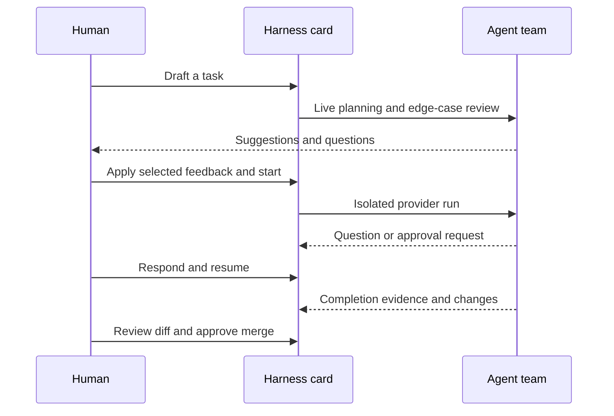

# Harness

Harness is a local-first desktop workspace for people who want several coding agents to collaborate on one accountable task card—not disappear into unrelated chat sessions. The board, agent definitions, run history, approvals, reviews, and Git worktrees stay with the project under `.harness/`.

## One card, one collaborative thread

1. Write a rough card in the desktop Draft modal.
2. Planning and edge-case reviewers comment live; accept selected suggestions or reply with constraints.
3. Approve the proposed revision, then assign or schedule the resulting task.
4. Harness runs the selected CLI provider inside the task workspace and streams normalized events.
5. Questions, permission requests, and command approvals pause the run without losing context.
6. Your response creates a linked resumed run; the completion report shows evidence and a snapshot-pinned file diff.
7. Review files and inline comments, create focused follow-ups, then approve the Git merge.



The same validation, scheduler, approval, workspace-protection, interaction, and audit services back Electron IPC, the optional HTTP transport, the CLI, and Harness MCP.

## Why it is different

- Local-first: project state lives in `<project>/.harness`; global preferences live under `HARNESS_HOME` or the user data directory.
- Accountable collaboration: drafts, handoffs, questions, approvals, retries, review comments, and merges remain attached to the card.
- Provider choice: mock, shell, Codex CLI, Claude Code, Gemini CLI, Ollama, Cursor Agent CLI, and custom wrappers share one run contract.
- Workspace isolation: code tasks use Git worktrees, canonical-path checks, snapshots, and a pre-push guard.
- No copied provider secrets: Codex, Claude, and Cursor reuse their own CLI login sessions.
- External control without policy bypass: scoped stdio MCP tools call the same application service.

## Current support

Supported now: source-run Electron desktop, browser/headless development, macOS/Windows/Linux folder adapters, project/task/agent management, live draft review, provider streaming, pause/resume interactions, completion reports and diffs, scoped MCP, and optional OTLP tracing.

Not currently shipped: signed desktop installers, auto-update, hosted multi-user sync, mobile clients, or a built-in remote LLM credential vault. Cursor desktop's `cursor` launcher is not the headless `cursor-agent` provider executable.

## Prerequisites

- Node.js 22 or newer (Node's built-in SQLite support is required).
- pnpm 11 (`corepack enable` is sufficient when Corepack is available).
- Git 2.30 or newer, with `user.name` and `user.email` configured for worktree commits.
- At least one provider: the built-in mock provider needs no install; real work needs one supported CLI or a configured shell command.

Harness is tested by this repository's CI-style commands on Node 24, pnpm 11, and Git 2.50. Earlier compatible releases may work but are not the verified baseline.

## Install from source and open the desktop

Signed installers are not available yet. Use the source workflow:

```bash
git clone https://github.com/jenemia/Harness.git
cd Harness
corepack enable
pnpm install
pnpm dev:desktop
```

`pnpm dev:desktop` builds the packages and opens Electron with packaged React assets. It does not start a persistent HTTP listener.

To build first and launch the same local desktop path:

```bash
pnpm build
pnpm --filter @harness/desktop start
```

Web-only development is separate:

```bash
pnpm dev
```

This starts the optional API on `http://localhost:4000` and Vite on `http://localhost:5173`. A built, single-process headless/web deployment uses `pnpm build && pnpm start`.

## First project smoke flow

Run the automated source smoke before configuring a paid provider:

```bash
pnpm smoke:quick-start
```

It uses a temporary `HARNESS_HOME` and project, registers the folder, creates the baseline Git commit, creates a shell-backed agent and selected task, verifies a command approval is raised, approves it, executes the task, and checks the completed run. It deletes all temporary data afterward.

In the desktop, the equivalent path is Projects → Add folder → Initialize Git (for a plain folder) → Agents → New Agent → New Work → Selected → Start → Attention/Approvals.

## Provider setup and login

Harness stores provider command configuration, never provider login credentials. Verify every configured backend with:

```bash
pnpm cli providers:list
```

| Backend | Install/login owned by | Harness checks | Typical command |
| --- | --- | --- | --- |
| Codex CLI | Codex CLI | `codex --version`, `codex login status` | `codex exec "$HARNESS_PROMPT_FILE"` |
| Claude Code | Claude CLI | `claude --version`, `claude auth status` | `claude -p "$(cat "$HARNESS_PROMPT_FILE")"` |
| Gemini CLI | Gemini CLI | executable/configured command | `gemini -p "$(cat "$HARNESS_PROMPT_FILE")"` |
| Ollama | local Ollama service | executable/configured command | `ollama run llama3.1 "$(cat "$HARNESS_PROMPT_FILE")"` |
| Cursor Agent | Cursor Agent CLI | `cursor-agent --version`, `cursor-agent status` | `cursor-agent -p --force --output-format stream-json` |

Official install entry points: [Codex CLI](https://github.com/openai/codex), [Claude Code](https://docs.anthropic.com/en/docs/claude-code/getting-started), [Gemini CLI](https://github.com/google-gemini/gemini-cli), [Ollama](https://ollama.com/download), and [Cursor Agent CLI](https://docs.cursor.com/en/cli/installation). Follow each provider's current installer and authentication flow; Harness only diagnoses the resulting executable/session.

Run `codex login`, `claude login`, or `cursor-agent login` in a terminal when its status check fails, then restart Harness so Electron receives the updated `PATH`. Gemini and Ollama authentication/model setup remains owned by those tools.

Provider command lookup checks `<platformProviderId>.<modelBackend>`, then `<nodePlatform>.<modelBackend>`, then `<modelBackend>`. For example on macOS:

```bash
pnpm cli settings:update --providerCommands '{"node-darwin.codex":"codex exec \"$HARNESS_PROMPT_FILE\"","codex":"codex exec \"$HARNESS_PROMPT_FILE\""}'
pnpm cli providers:list
```

Direct future API integrations must use OAuth and the OS keychain; credentials must never be stored in `.harness/`, prompts, events, reports, or telemetry.

## Cursor desktop, Cursor Agent, and MCP

These are three distinct paths:

- `/Applications/Cursor.app/Contents/Resources/app/bin/cursor` opens/controls Cursor desktop on macOS; it does not satisfy the `cursor-agent` provider check.
- `cursor-agent` is the headless execution provider Harness launches inside a task workspace.
- Cursor as an MCP client launches `harness-mcp-server` and uses Harness board tools.

Register a read-only MCP client and run the protocol smoke:

```bash
pnpm --filter @harness/server cli mcp:client-save --client cursor --read true --write false
printf '%s\n' '{"jsonrpc":"2.0","id":1,"method":"tools/list","params":{}}' \
  | pnpm --filter @harness/server mcp -- --client cursor
```

Cursor, Claude Desktop, Codex, permission scopes, installed/source JSON, and diagnostics are documented in [Harness MCP setup](Document/mcp-setup.md).

## OS notes

- macOS uses the built-in `osascript` folder chooser. Electron launched from Finder may have a smaller `PATH`; start it from a configured terminal or use absolute provider commands.
- Windows uses the STA PowerShell folder dialog and a named-pipe application bridge. Ensure PowerShell and Git are on `PATH`.
- Linux tries `zenity`, then `kdialog`; install one for native folder selection. Headless environments can register a folder with the CLI.

## Troubleshooting

- Port busy: desktop needs no HTTP port. For web development use `PORT=4010 pnpm dev:server` and `VITE_API_PROXY_TARGET=http://localhost:4010 pnpm dev:web`.
- Provider missing: run `pnpm cli providers:list`, then use the reported login command. Confirm the executable from the same shell that launches Electron.
- Cursor desktop found but Cursor provider missing: the `cursor` and `cursor-agent` executables are different; install/login to Cursor Agent CLI.
- Git initialization error: configure Git identity, then run `pnpm cli projects:init-git --project <projectId>` before a worktree task.
- Approval never runs: check Attention/Approvals or `pnpm cli approvals:list --project <projectId> --status pending`.
- MCP connection failure: run `pnpm --filter @harness/server cli mcp:diagnose`, verify the client id is configured, and repeat the read-only stdio smoke above.
- Moved project: re-link with `pnpm cli projects:update --project <projectId> --path <new-path>`; project-local state moves with `.harness/`.

## Architecture and reference

- [Local desktop architecture](Document/local-desktop-architecture.md)
- [MCP setup](Document/mcp-setup.md)
- [OpenTelemetry/OTLP](Document/observability.md)
- [Optional macOS Agent Dog Overlay](Document/agent-dog-overlay.md)
- [CLI reference](Document/cli-reference.md) and `pnpm cli --help` for the complete JSON command list

## Verify changes

```bash
pnpm typecheck
pnpm test
pnpm build
pnpm smoke:quick-start
```
